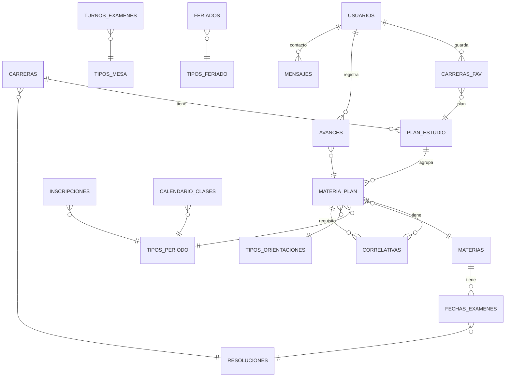

# Cursa-Plan

**Tu carrera universitaria, más clara y organizada que nunca.**

[](https://nextjs.org)
[](https://react.dev)
[](https://www.typescriptlang.org)
[](https://tailwindcss.com)
[](https://supabase.com)
[](LICENSE)

🌐 **Deploy:** [cursa-plan-v4.vercel.app](https://cursa-plan-v4.vercel.app)

---

## Índice

- [Para estudiantes](#para-estudiantes)
- [Para desarrolladores](#para-desarrolladores)

---

## Para estudiantes

### ¿Qué es Cursa-Plan?

**Cursa-Plan** es una herramienta web diseñada para ayudarte a organizar tu recorrido académico universitario. Te permite visualizar la malla curricular de tu carrera, verificar las correlatividades exigidas para cursar o rendir cada materia, consultar fechas de exámenes finales y marcar tu avance personal, todo en un solo lugar.

Nuestra misión es simplificar la vida universitaria y reducir la incertidumbre al momento de armar las cursadas de cada cuatrimestre. Los datos provienen de resoluciones públicas y publicaciones universitarias verificadas.

### Funcionalidades

- **📚 Catálogo de carreras** — Explora la oferta académica con filtros por tipo de carrera
  - Ruta: `/carreras`

- **🗂️ Malla curricular interactiva** — Visualiza todas las materias agrupadas por año y período, con la opción de filtrar por orientación
  - Ruta: `/carreras/[carreraSlug]/[plan]`

- **📖 Detalle de materias** — Información completa de cada materia: año, período, tipo (obligatoria/optativa), correlativas y mesas de examen
  - Ruta: `/carreras/[carreraSlug]/[plan]/[materia]`

- **🔗 Detector de correlativas** — Distinción clara entre:
  - **Correlativas para cursar:** Materias que debés tener en condición Regular o Aprobada para inscribirte al cursado
  - **Correlativas para rendir:** Materias que debés tener totalmente Aprobadas para rendir el examen final

- **📅 Calendario académico unificado** — Turnos de examen, inscripciones, calendario de clases y feriados, con visualización por año
  - Rutas: `/calendario`, `/calendario/[anio]`

- **🔍 Buscador rápido** — Busca materias y carreras con una paleta de comandos integrada en la malla curricular

- **👤 Seguimiento personal** (requiere cuenta gratuita) — Marca el estado de cada materia (Sin cursar, Cursando, Regular, Aprobado, Libre), guarda planes favoritos, visualiza tu progreso con KPIs y porcentaje de avance
  - Rutas: `/perfil`, `/perfil/carrera/[carreraSlug]`, `/perfil/configuracion`

- **🌓 Tema claro/oscuro** — Interfaz adaptable al sistema o preferencia del usuario

- **📱 Diseño responsive** — Funciona perfectamente en desktop, tablet y dispositivos móviles

### ⚠️ Aviso importante

Cursa-Plan recopila datos de buena fe a partir de resoluciones públicas y publicaciones universitarias. **No es un sistema oficial**. Ante cualquier trámite o inscripción decisiva, te sugerimos confirmar la información directamente en el **SIU Guaraní** o la cartelera de tu facultad.

### 🤝 ¿Encontraste un error?

Si detectas datos desactualizados, correlativas mal cargadas o fechas de examen incorrectas:
- Usá el formulario de **[Contacto](/contacto)** o **[Reporta un Error](/errores)**
- Abrí un [issue en GitHub](https://github.com/MatiasSolisSchneeberger/cursa-plan-v4/issues)

---

<!-- 
=================================================================================
CAPTURA DE PANTALLA #1 — Malla Curricular
=================================================================================
Descripción: Captura panorámica en modo claro y oscuro del plan de estudio de 
una carrera (ej. Ingeniería en Sistemas). Muestra:
  - La malla curricular agrupada por años (1º, 2º, 3º, 4º)
  - Períodos dentro de cada año
  - Tarjetas de materias con nombre, código y tipo (Obligatoria/Optativa)
  - (Opcional) Líneas de correlatividades conectando materias dependientes
  - Botón de filtro de orientación
  
Guardar en: /public/assets/plan-curricular.png
=================================================================================
-->

---

## 🛠️ Para desarrolladores

### Stack tecnológico

| Componente | Versión | Detalle |
|---|---|---|
| **Frontend** | Next.js 16.2.10 | App Router, `cacheComponents: true` (Cache Components / `"use cache"`) |
| **Runtime** | React 19.2.4 | Concurrency, transitions, optimistic updates |
| **Lenguaje** | TypeScript 5 | Strict mode, no `any` |
| **Estilos** | Tailwind CSS v4 | CSS-first, sin `tailwind.config` (config en `globals.css`) |
| **UI Components** | shadcn/ui | Style `base-nova`, sobre `@base-ui/react` (no Radix), iconos Tabler |
| **Utilidades** | `motion`, `@tanstack/react-table`, `react-day-picker`, `date-fns`, `zod` | Animaciones, tablas, calendarios, validación |
| **Base de datos** | PostgreSQL/Supabase | `@supabase/supabase-js`, `@supabase/ssr` |
| **Markdown** | MDX | `@next/mdx` para páginas de contenido |
| **Deploy & Observabilidad** | Vercel | Serverless, environment variables, Web Analytics, Speed Insights |

### Requisitos previos

- **Node.js:** 20+ (se desarrolla sobre 22.x; Next 16 requiere ≥20.9)
- **npm:** es el único package manager usado (el proyecto tiene `package-lock.json`)
- **Supabase:** un proyecto propio con base de datos PostgreSQL configurado

### Setup rápido

**1. Clonar el repo**

```bash
git clone https://github.com/MatiasSolisSchneeberger/cursa-plan-v4.git
```

**2. Instalar dependencias**

```bash
npm install
```

**3. Configurar variables de entorno**

```bash
cp .env.example .env.local
```

Luego abre `.env.local` y completa los valores (ver tabla abajo).

**4. Iniciar el servidor de desarrollo**

```bash
npm run dev
```

Abre [http://localhost:3000](http://localhost:3000) en tu navegador.

### Variables de entorno

| Variable | Obligatoria | Descripción | Cómo obtenerla |
|---|---|---|---|
| `NEXT_PUBLIC_SUPABASE_URL` | Sí | URL del proyecto Supabase | Supabase Dashboard → Project Settings → API → Project URL |
| `NEXT_PUBLIC_SUPABASE_ANON_KEY` | Sí | Clave anónima de Supabase (públicamente segura) | Supabase Dashboard → Project Settings → API → Anon key |
| `NEXT_PUBLIC_SITE_URL` | Recomendada | URL canónica del sitio (metadata, sitemap, robots, OG, redirects de auth) | En desarrollo: `http://localhost:3000`; en producción: tu dominio |
| `SUPABASE_SERVICE_ROLE_KEY` | Opcional | Clave de rol de servicio (solo para el importador CSV de fechas) | Supabase Dashboard → Project Settings → API → Service role key. **NUNCA** uses prefijo `NEXT_PUBLIC_` |
| `VERCEL_PROJECT_PRODUCTION_URL` / `VERCEL_URL` | Automática en Vercel | Fallback de URL base si `NEXT_PUBLIC_SITE_URL` no está configurada | Vercel la inyecta automáticamente |

**Orden de resolución de URL:** `NEXT_PUBLIC_SITE_URL` → `https://$VERCEL_PROJECT_PRODUCTION_URL` → `http://localhost:3000`

**Tip:** En Vercel, usa `vercel env pull` para descargar todas las variables (también escribe `VERCEL_OIDC_TOKEN`).

### Scripts disponibles

| Script | Comando | Descripción |
|---|---|---|
| `dev` | `npm run dev` | Servidor de desarrollo con hot-reload |
| `build` | `npm run build` | Build de producción |
| `start` | `npm run start` | Ejecuta el build de producción localmente |
| `lint` | `npm run lint` | Linter ESLint (TypeScript + Next.js config) |

**Nota:** No hay scripts de `test` ni `format` configurados (testing: `-` según AGENTS.md).

### Estructura del proyecto

```
cursa-plan-v4/
├── app/                          # App Router de Next.js
│   ├── (main)/                   # Grupo de rutas públicas (navbar + footer)
│   │   ├── page.tsx              # Landing page (/)
│   │   ├── carreras/             # Catálogo de carreras
│   │   ├── calendario/           # Calendario académico
│   │   ├── [slug]/               # Páginas MDX (acerca-de, contacto, etc.)
│   │   ├── auth/                 # Login, registro, recuperación
│   │   └── layout.tsx            # Shell con Navbar y Footer
│   ├── carreras/[carreraSlug]/[plan]/ # Malla curricular (con sidebar)
│   ├── admin/                    # Panel de administración (protegido)
│   ├── perfil/                   # Dashboard del estudiante (protegido)
│   ├── auth/callback/            # OAuth callback
│   ├── robots.ts                 # SEO: robots.txt
│   ├── sitemap.ts                # SEO: sitemap.xml (generado desde Supabase)
│   ├── opengraph-image.tsx       # OG image dinámica
│   └── layout.tsx                # Root layout
├── components/                   # Componentes reutilizables
│   ├── ui/                       # Primitivos shadcn/ui (botones, inputs, etc.)
│   └── [otros componentes]
├── sections/                     # Vistas por feature (landing, admin, plan, etc.)
├── lib/                          # Data access, server actions, helpers
│   ├── carreras.ts               # Queries públicas cacheadas
│   ├── carrerasAdmin.ts          # Server actions de CRUD carreras
│   ├── actions.ts                # Server actions (contacto, favoritos, etc.)
│   ├── auth.ts                   # Lógica de autenticación
│   ├── permissions.ts            # RBAC y checks de permisos
│   ├── site.ts                   # Resolución de URL canónica
│   ├── og.ts                     # Config de OG images
│   └── [otros helpers]
├── utils/                        # Funciones de utilidad
│   ├── supabase/                 # Clientes de Supabase (client, server, proxy)
│   └── [otros helpers]
├── types/                        # Interfaces TypeScript (escritas a mano)
├── hooks/                        # React hooks personalizados
├── content/                      # Páginas MDX
├── scripts/                      # Scripts de utilidad (ej: importador CSV)
├── supabase/migrations/          # Migraciones de base de datos
├── public/                       # Archivos estáticos
└── [configs: next.config.ts, tsconfig.json, tailwind.config.css, etc.]
```

**Convenciones:**
- `sections/` = vistas por feature (landing, admin, plan, calendario, etc.) — componentes grandes y verticales
- `components/` = componentes reutilizables — inputs, botones, tarjetas, etc.
- `lib/` = data access (queries, server actions, helpers de negocio) — **todo acceso a BD pasa por acá**
- `types/` = interfaces TypeScript — **escritas a mano** (no hay tipos generados por Supabase en este proyecto)

**Shells de layout:**
- `(main)` — Navbar + Footer (público)
- `carreras/[carreraSlug]/[plan]` — Sidebar (malla curricular), con theming por carrera vía clase `theme-${carreraSlug}`
- `admin` — Sidebar de admin (protegido, requiere rol admin)
- `perfil` — Sidebar de perfil (protegido, requiere autenticación)

### Rutas principales

#### Públicas

| Ruta | Descripción |
|---|---|
| `/` | Landing page con hero, llamadas a acción y listado de carreras |
| `/carreras` | Catálogo de carreras con filtro por tipo |
| `/carreras/[carreraSlug]/[plan]` | Malla curricular (plan acepta año o id) |
| `/carreras/[carreraSlug]/[plan]/[materia]` | Detalle de materia con correlativas y exámenes |
| `/calendario`, `/calendario/[anio]` | Calendario académico unificado |
| `/[slug]` | Páginas MDX: acerca-de, preguntas-frecuentes, contacto, errores, términos-y-condiciones, política-de-privacidad, avisos-legales |
| `/login`, `/register` | Autenticación |

#### Autenticadas (requieren sesión)

| Ruta | Descripción |
|---|---|
| `/perfil` | Dashboard del estudiante (resumen, KPIs, carreras favoritas) |
| `/perfil/carrera/[carreraSlug]` | Progreso en una carrera específica |
| `/perfil/configuracion` | Edición de perfil (nombre, usuario, contraseña) |

#### Administración (requieren rol admin)

| Ruta | Descripción |
|---|---|
| `/admin/carreras` | CRUD de carreras y planes de estudio |
| `/admin/fechas-examenes` | Planilla materias × turnos, fechas de examen |
| `/admin/usuarios` | Listado de admins (UI only, sin backend) |
| `/admin/roles` | Gestión de roles (UI only, sin backend) |
| `/admin/permisos` | Catálogo de permisos (UI only, sin backend) |
| `/admin/auditoria` | Logs de auditoría (UI only, sin backend) |
| `/admin/configuracion` | Políticas de seguridad (UI only, sin backend) |

**Nota sobre rutas legacy:** `/carreras/[carreraSlug]/[plan]/[materia]/{correlativas,examenes,recursos}` son **redirects a anclas** de la página principal. Usá los helpers [lib/rutas.ts](lib/rutas.ts): `rutaPlan(carreraSlug, plan)` y `rutaMateria(...)`.

### Modelo de datos



**Aclaraciones importantes:**

- **Correlativas por plan:** `correlativas.materia_id` y `correlativas.requisito` apuntan a **`materia_plan`**, no a `materias`. Las correlativas se definen **por plan**, no globalmente.
- **Exámenes por materia:** `fechas_examenes.materia_id` sí apunta a **`materias`** (la mesa es global, no por plan).
- **Dominios:**
  - `correlativas.tipo_requisito` ∈ {`cursar`, `rendir`}
  - `correlativas.condicion` ∈ {`regular`, `aprobado`}
  - `avances.estado` ∈ {`Sin cursar`, `Cursando`, `Regular`, `Aprobado`, `Libre`}
- **Favoritos:** `carreras_fav` guarda **planes**, no carreras.

### Autenticación y roles

**Proveedor:** Supabase Auth con **email + contraseña**.

**Flujo:**
- `signUp({email, password, fullName, username})` — crear cuenta
- `signInWithEmail({email, password})` — iniciar sesión
- `resetPasswordForEmail(email)` — recuperar contraseña
- `updateUser({password})` — cambiar contraseña
- `signOut()` — cerrar sesión

**Nota:** `signInWithOAuth(provider)` está implementado pero **no está cableado a ninguna UI** hoy (no hay botones de Google/GitHub).

**Sesión:** Se refresca en [proxy.ts](proxy.ts) (Next 16 renombró `middleware.ts` → `proxy.ts`). Rotación de cookies automática con `Cache-Control: private, no-store`.

**Callback:** `app/auth/callback/route.ts` intercambia el código por sesión y redirige a `?next=...` (protegido contra open-redirect).

**Protección de rutas:** Se hace server-side en los layouts (`app/perfil/layout.tsx`, `app/admin/layout.tsx`), no en middleware.

**Roles:**

| Rol | Descripción | Rutas |
|---|---|---|
| `super_admin` | Control total del sistema | Todo `/admin/*` |
| `admin` | Administrador general | Todo `/admin/*` |
| `gestor_carreras` | Gestión de carreras y planes | `/admin/carreras`, `/admin/fechas-examenes` |
| `moderador` | Moderar contenido | (Extensible) |
| `auditor` | Ver auditoría y logs | (Extensible) |
| `soporte` | Soporte a usuarios | (Extensible) |
| `user` | Estudiante | `/perfil`, resto es público |

Definidos en [lib/permissions.ts](lib/permissions.ts) con `ROUTE_PERMISSIONS` por subpágina de `/admin`.

**⚠️ Conocido:** La RLS usa `public.is_admin()` que exige `role = 'admin'` exacto, así que roles intermedios pasan el gate de UI pero fallan en la BD. Esto es un pendiente conocido.

### Panel de administración

**Funcional (acceso a BD):**
- **`/admin/carreras`** — CRUD de carreras, planes de estudio y resoluciones ([lib/carrerasAdmin.ts](lib/carrerasAdmin.ts))
- **`/admin/fechas-examenes`** — Planilla interactiva materias × turnos, agregar/editar fechas ([lib/fechasExamenesAdmin.ts](lib/fechasExamenesAdmin.ts))
- **Importador CSV** — [scripts/procesar-csv.ts](scripts/procesar-csv.ts) para carga en lote de fechas

**Prototipos de UI (sin backend):**
- `/admin/usuarios` — Listado de admins (datos hardcodeados)
- `/admin/roles` — Gestión de roles (UI only)
- `/admin/permisos` — Catálogo de permisos (UI only)
- `/admin/auditoria` — Logs de auditoría (UI only)
- `/admin/configuracion` — Políticas de seguridad (UI only)

### Datos y caché

**Patrón de acceso a datos** ([lib/carreras.ts](lib/carreras.ts), 1479 líneas):
- `staticSupabase` — cliente sin cookies, para queries públicas dentro de `"use cache"` + `cacheLife("hours"|"days")`
- `createClient(cookieStore)` — para queries scopeadas al usuario, envueltas en React `cache()`
- Server actions con Zod en [lib/actions.ts](lib/actions.ts): `setContacto` (rate-limit por IP vía RPC fail-closed), `setToggleFavoritoPlan`, `setEstadoMateria`, `setPerfilUsuario`

### Base de datos y migraciones

El schema se versiona en `supabase/migrations/`. **No edites el schema a mano.**

**⚠️ Importante:** El directorio `supabase/migrations/` está en `.gitignore`, así que quien clone el repo **no recibe las migraciones ni el schema**. La única referencia disponible es el diagrama arriba. Esto es un pendiente conocido (documentar migraciones en un archivo trackeable).

### SEO

- **Metadata dinámica:** `generateMetadata` en páginas de plan y materia, con `alternates.canonical`
- **Sitemap:** `app/sitemap.ts` generado desde Supabase (home, carreras, planes, materias, años de calendario, páginas MDX). Cada sección tiene try/catch.
- **Robots:** `app/robots.ts` bloquea `/admin`, `/perfil`, `/auth/`, `/update-password`
- **OG images:** `opengraph-image.tsx` en raíz, plan y materia, renderizadas dinámicamente con `next/og` + config en [lib/og.ts](lib/og.ts)

### Convenciones de código

(Ver [AGENTS.md](AGENTS.md) para el detalle completo)

- `camelCase` para archivos de lógica y variables
- `PascalCase` para componentes y archivos de UI
- `any` está **estrictamente prohibido**
- Desestructuración obligatoria en callbacks de arrays (`.map`, `.filter`, etc.)
- No agregar librerías externas sin consulta
- No editar el schema a mano; usá migraciones
- No dejar `console.log` ni comentarios de código muerto en commits

### Deploy a Vercel

1. Importá el repo en Vercel (conectando tu GitHub)
2. Cargá las variables de entorno en Project Settings → Environment Variables:
   - `NEXT_PUBLIC_SUPABASE_URL`
   - `NEXT_PUBLIC_SUPABASE_ANON_KEY`
   - `NEXT_PUBLIC_SITE_URL` (tu dominio de producción, ej. `https://cursa-plan.vercel.app`)
   - `SUPABASE_SERVICE_ROLE_KEY` (opcional, solo si usarás el importador CSV)
3. Habilitar Web Analytics y Speed Insights:
   - Entrá a tu proyecto en el dashboard de Vercel
   - Navegá a Analytics → Enable Web Analytics
   - Navegá a Speed Insights → Enable Speed Insights
   - **Nota:** No requieren variables de entorno — se activan desde el dashboard
4. Vercel build automático: `npm run build`
5. Deploy automático en cada push a `master` (o la rama que configures)

### Privacidad y Analítica

La plataforma utiliza **Vercel Web Analytics** y **Vercel Speed Insights** para medir uso y rendimiento. Ambos servicios son **cookieless** (no escriben cookies ni identificadores persistentes) y recopilan datos anónimos y agregados. Consultá la [Política de Privacidad](/politica-de-privacidad) para el detalle completo sobre qué datos se recolectan y cómo se tratan.

> **Importante para desarrolladores:** Cualquier cambio en la estrategia de recolección de datos (cambio de proveedor, nuevas métricas, etc.) debe reflejarse en los documentos legales (`content/politica-de-privacidad.mdx`, `content/terminos-y-condiciones.mdx`, `content/acerca-de.mdx`) **antes de deployar a producción**.

---

<!-- 
=================================================================================
CAPTURA DE PANTALLA #2 — Calendario Académico
=================================================================================
Descripción: Captura del calendario académico (/calendario) mostrando:
  - Las pestañas Feriados / Clases / Inscripciones / Exámenes
  - La vista de mes (o tabla) con eventos coloreados por tipo
  - Selector de año (ej. "2026")
  - Panel "Hoy" con eventos próximos
  
Guardar en: /public/assets/calendario.png
=================================================================================
-->

---

<!-- 
=================================================================================
CAPTURA DE PANTALLA #3 — Detalle de Materia
=================================================================================
Descripción: Captura de la página de una materia mostrando:
  - Encabezado con nombre, año, período
  - Tarjeta de "Correlativas para Cursar" (con requisitos y iconos de condición)
  - Tarjeta de "Correlativas para Rendir" (con requisitos y iconos)
  - Sección de "Mesas de Exámenes" con próximas fechas
  - (Opcional) Selector de estado de materia (Sin cursar / Cursando / Regular / Aprobado / Libre)
  
Guardar en: /public/assets/detalle-materia.png
=================================================================================
-->

---

<!-- 
=================================================================================
CAPTURA DE PANTALLA #4 — Dashboard de Perfil
=================================================================================
Descripción: Captura de /perfil mostrando:
  - Encabezado de bienvenida con nombre del usuario
  - KPIs: Cursando, Regulares, Aprobadas, Favoritas
  - Sección "Carreras Favoritas" con tarjetas y botón "Ver Dashboard de Carrera"
  - Sección "Materias en Cursada"
  - Resumen general de avance (porcentaje, barra de progreso)
  - (Opcional) Vista en modo oscuro además de la clara
  
Guardar en: /public/assets/perfil.png
=================================================================================
-->

---

## En desarrollo

Las siguientes secciones son prototipos y aún no tienen funcionalidad completa:

- **`/novedades`** — Muestra "Próximamente"
- **`/mesas-examenes`** — Muestra "Próximamente"
- **Notificaciones** — UI completada, sin backend
- **Eliminación de cuenta** — UI completada en `/perfil/configuracion`, sin backend

---

## Licencia

MIT © 2026 [Matias Solis Schneeberger](mailto:matias.solis.sch@gmail.com)

Ver [LICENSE](LICENSE) para detalles completos.

---

## Contacto y feedback

- 💬 **Reportar errores:** [/errores](/errores) o [contacto](/contacto)
- 🐛 **Issues en GitHub:** [github.com/MatiasSolisSchneeberger/cursa-plan-v4/issues](https://github.com/MatiasSolisSchneeberger/cursa-plan-v4/issues)
- 📧 **Email:** matias.solis.sch@gmail.com
